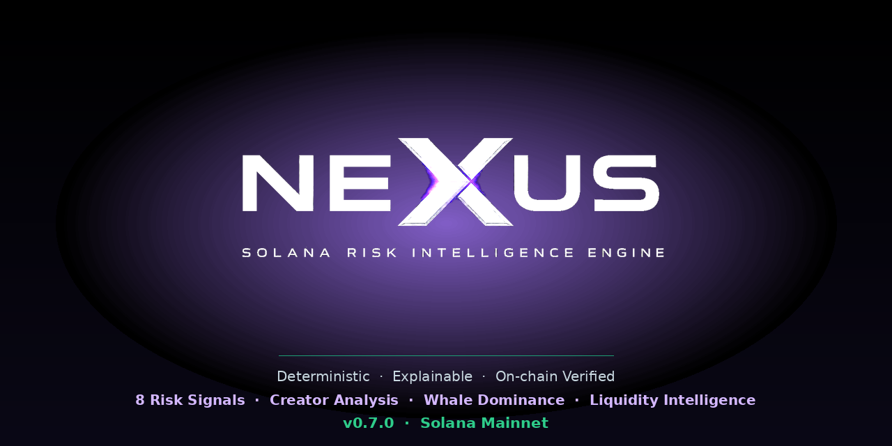

# NexusVeritas API

Solana risk intelligence API with deterministic multi-signal risk scoring.

## Overview

NexusVeritas is a Solana risk intelligence engine that evaluates tokens using independent on-chain signals and produces an explainable risk score.

The goal is simple: identify suspicious tokens before users interact with them.

## Design Principles

- Deterministic scoring
- Explainable risk factors
- On-chain verification
- Fail-safe operation
- No AI-generated scores

Every risk signal is derived from observable blockchain state. Scores are reproducible for identical blockchain conditions.

## Explainable Scoring (v0.8.0)

Every score includes a full breakdown showing how each signal contributed.

```
Risk Score: 100 (CRITICAL)

Contributors:
+30  No Liquidity Pool
+25  Mint Authority Enabled
+20  Serial Token Deployer (96+ tokens)
+20  Whale Controls 76%
+15  Freeze Authority Enabled
+15  Holder Concentration 100%
+15  Top 3 Wallets Control 97%
```

## Risk Signals (v0.7.0)

- Mint Authority Analysis
- Freeze Authority Analysis
- Holder Concentration
- Token Age Analysis
- Burner Wallet Detection
- Creator Wallet Analysis
- Whale Dominance
- Liquidity Analysis

## Validation on Real Tokens

All examples below are generated by the live scoring engine.

| Token | Score | Class | Notes |
|-------|-------|-------|-------|
| BONK  | 0     | LOW    | No significant risk factors |
| USDC  | 40    | MEDIUM | Mint + Freeze authority (Circle controlled) |
| pump.fun token | 85 | CRITICAL | Low liquidity + young token |
| Known scam cluster | 100 | CRITICAL | Serial deployer + whale dominance + zero liquidity |

## API

### GET /api/risk/solana/:address

```json
{
  "address": "3RPv...",
  "chain": "solana",
  "score": 100,
  "class": "CRITICAL",
  "reasons": [
    "Serial token deployer — creator launched 96+ tokens",
    "Single whale controls 76% of supply",
    "Top 3 wallets control 97% of supply",
    "No liquidity pool found"
  ],
  "confidence": "standard"
}
```

Each reason represents an independently triggered risk signal.
Scores are deterministic and reproducible for identical blockchain state.

### GET /api/risk/solana/:address?debug=true

Returns full snapshot including all analysis modules.

### GET /health

```json
{ "status": "ok", "version": "0.7.0" }
```

## Risk Classes

| Class    | Score  | Interpretation                  |
|----------|--------|---------------------------------|
| LOW      | 0–19   | No significant risk factors     |
| MEDIUM   | 20–59  | Multiple caution signals        |
| HIGH     | 60–84  | Significant risk indicators     |
| CRITICAL | 85–100 | Extreme risk profile            |

## Changelog

- **v0.7.0** — Liquidity Analysis via DexScreener
- **v0.6.0** — Whale Dominance Analysis
- **v0.5.0** — Creator Wallet Analysis, serial deployer detection
- **v0.4.1** — Rate limiting, fail-safe, snapshot validation
- **v0.4.0** — Burner Registry detection
- **v0.3.0** — Token Age Analysis with reliability validation
- **v0.2.0** — Real Solana RPC integration via Helius
- **v0.1.0** — Risk Engine MVP

## Stack

TypeScript · Node.js · Express · Helius RPC · DexScreener API

## Architecture Note

Risk scoring logic in this repository represents the public MVP ruleset. Advanced behavioral analysis, simulation modules, and proprietary heuristics are implemented in the private NexusVeritas Core.

## Part of Veritas Ecosystem

- [CryptaVeritas](https://github.com/cryptaveritas) — signal verification protocol
- NexusVeritas — multichain token risk engine (this repo)

## Media


